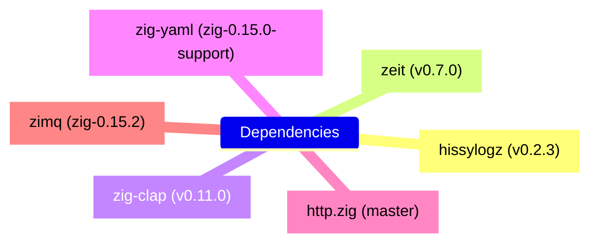

<!--
SPDX-FileCopyrightText: Copyright © 2025 The Dymes project authors

SPDX-License-Identifier: Apache-2.0
-->

# Third-party dependencies

Dymes has a few dependencies on third-party libraries, which are all
open source under OSI-approved licenses.




## [hissylogz](https://github.com/hissyfit-dev/hissylogz) v0.2.3

Low-ceremony, thread-safe structured logging for Zig.

```shell
zig fetch --save https://github.com/hissyfit-dev/hissylogz/archive/refs/tags/v0.2.3.tar.gz
```

## [zeit](https://github.com/rockorager/zeit) v0.7.0

A date and time library written in zig. Timezone, DST, and leap second aware.

```shell
zig fetch --save https://github.com/rockorager/zeit/archive/refs/tags/v0.7.0.tar.gz
```

## [zig-clap](https://github.com/Hejsil/zig-clap) v0.11.0

A simple and easy to use command line argument parser library for Zig.

```shell
zig fetch --save https://github.com/Hejsil/zig-clap/archive/refs/tags/0.11.0.tar.gz
```

## [zig-yaml](https://github.com/carlmontanari/zig-yaml/tarball/feat/zig-0.15.0-support) (Pending, using fork)

YAML parser for Zig.

> Switch to `https://github.com/kubkon/zig-yaml` once upstream supports Zig 0.15.x

```shell
zig fetch --save https://github.com/carlmontanari/zig-yaml/tarball/feat/zig-0.15.0-support
#zig fetch --save https://github.com/kubkon/zig-yaml/archive/refs/tags/0.1.1.tar.gz
```

## [http.zig](https://github.com/karlseguin/http.zig) master

An HTTP/1.1 server for Zig.

```shell
zig fetch --save "git+https://github.com/karlseguin/http.zig#master"
```

## [zimq](https://github.com/uyha/zimq)

Zig bindings for ZeroMQ.

```shell
zig fetch --save https://github.com/uyha/zimq/archive/refs/tags/zig-0.15.2.tar.gz

```
