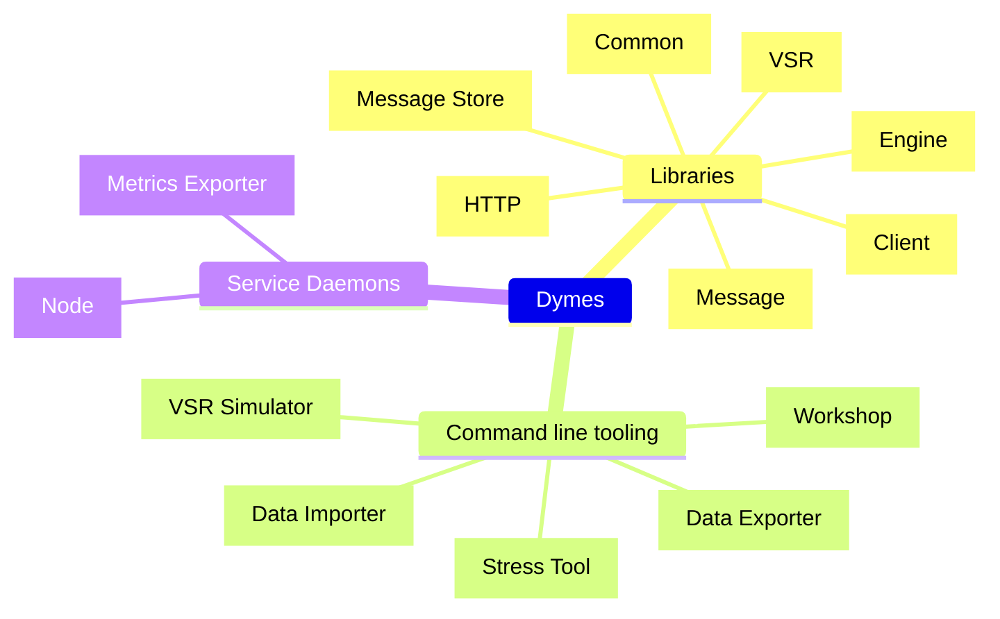
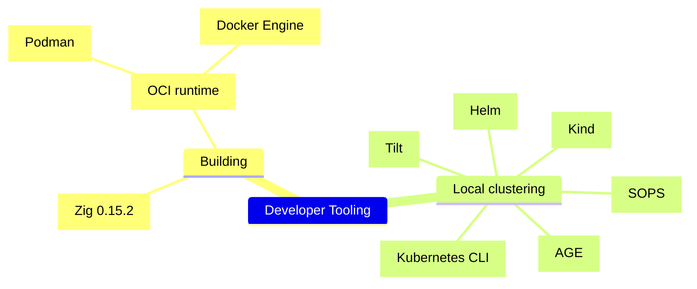
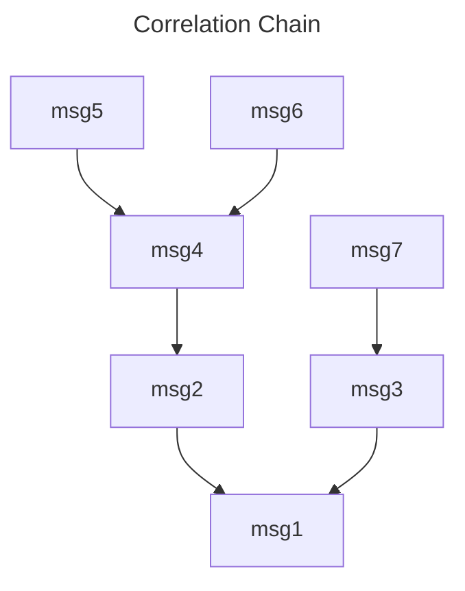

<!--
SPDX-FileCopyrightText: Copyright © 2025 The Dymes project authors

SPDX-License-Identifier: Apache-2.0
-->
# Developing Dymes

<!-- TOC -->
* [Developing Dymes](#developing-dymes)
  * [Components](#components)
  * [Development Tooling](#development-tooling)
  * [Building and running locally](#building-and-running-locally)
    * [Build Dymes and run unit tests](#build-dymes-and-run-unit-tests)
    * [Run a local node](#run-a-local-node)
    * [Stress the local node](#stress-the-local-node)
    * [Build local container image](#build-local-container-image)
      * [Running interactive using the Docker image](#running-interactive-using-the-docker-image)
      * [Running as daemon using the Docker image](#running-as-daemon-using-the-docker-image)
      * [Building release images](#building-release-images)
    * [Dymes HTTP](#dymes-http)
  * [Dymes message concepts](#dymes-message-concepts)
    * [Correlation Identifier](#correlation-identifier)
    * [Routing value and routing mask](#routing-value-and-routing-mask)
      * [Widening (traditional) route masking](#widening-traditional-route-masking)
        * [Example of widening route masking](#example-of-widening-route-masking)
      * [Narrowing (constrictive) route masking](#narrowing-constrictive-route-masking)
        * [Example of narrowing route masking](#example-of-narrowing-route-masking)
      * [Flexible narrowing (constrictive) route masking](#flexible-narrowing-constrictive-route-masking)
        * [Example of flexible narrowing (constrictive) route masking](#example-of-flexible-narrowing-constrictive-route-masking)
<!-- TOC -->

## Components



For more detail on the libraries, tools and daemons comprising Dymes, refer to:
- [Dymes Components](./doc/dymes-components.md)
- [Dymes Component Flow](./doc/dymes-component-flow.md)

---
## Development Tooling



Refer to [Development Tooling](./doc/dev-tooling.md) for more detail on the prerequisite libraries, and tools required for Dymes development.


---
## Building and running locally

### Build Dymes and run unit tests

```sh
make
```

or

```sh
zig build test -freference-trace --summary all
```


### Run a local node

```sh
zig build run
```

### Stress the local node

```sh
zig build stress
```

### Build local container image

```sh
make oci
```

or

```sh
scripts/build-oci.sh
```

#### Running interactive using the Docker image

```sh
podman run --rm -p 6510:6510 -it dymes:latest
```

#### Running as daemon using the Docker image

```sh
podman run --name dymes -v ./zig-out/dymes-data:/var/dymes/data -p 6510:6510 -d dymes:latest
```

#### Building release images

```shell
scripts/build-release.sh
```

This builds images for:

| OS     | Processor       | Linkage |
|--------|-----------------|---------|
| linux  | `x86-64/amd64`  | `musl`  |
| linux  | `aarch64/arm64` | `musl`  |


### Dymes HTTP

See [Dymes HTTP](./doc/dymes-http.md) for a description of interactions between a Dymes client and server node.


---
## Dymes message concepts

Essentially, Dymes stores messages, and allows such stored message to be queried.

Regardless of the type of scenario Dymes is being used in (as a commit log, source of events, etc.) there
are concepts around the use of *message identifiers*, *correlation identifiers* and *routing values* that need to be kept in mind.

---
### Correlation Identifier

Correlation identifiers are used to build message/event chains, which form an anti-arborescence (in-tree) [rooted tree](https://en.wikipedia.org/wiki/Tree_(graph_theory)#Rooted_tree).

For example, given the following commits:

| Message Id | Correlation Id |
|------------|----------------|
| `msg1`     | *nil*          |
| `msg2`     | `msg1`         |
| `msg3`     | `msg1`         |
| `msg4`     | `msg2`         |
| `msg5`     | `msg4`         |
| `msg6`     | `msg4`         |
| `msg7`     | `msg3`         |


These will form the following correlation chain:




> Note that a correlation id of zeroes (all bits 0x0) is regarded as NIL

---
### Routing value and routing mask

The routing mask allows bitwise masking of routing values for filtering purposes.

Routing masks are applied in a "masked off" fashion, such that when a bit is `ANDed` with a `0`, the result is always `0`,

i.e. `Y AND 0 = 0`.

To leave the other bits as they were originally, they can be `ANDed` with `1`,

i.e. `Y AND 1 = Y`

Example of masking off the higher nibble (bits 4, 5, 6, 7) while leaving the lower nibble (bits 0, 1, 2, 3) unchanged.

|     | Value    |
|-----|----------|
|     | 10010101 |
| AND | 00001111 |
|  =  | 00000101 |

#### Widening (traditional) route masking

> If, after applying `routing mask`, the result is non-zero, it passed the filter.

In code:
```zig
const passed_filter = 0x0 != (message.frame_header.routing & routing_mask);
```

This acts as a _widening_ route filter.

##### Example of widening route masking

Given a convention of using the following bit flags:

| Routing Value | Meaning  |
|---------------|----------|
| `0000001`     | DA       |
| `0000010`     | DC       |
| `0000100`     | Inbound  |
| `0001000`     | Outbound |

We can represent conventional message 'types' using the following routing values:

| Routing Value | Meaning     |
|---------------|-------------|
| `0000101`     | DA Inbound  |
| `0001001`     | DA Outbound |
| `0000110`     | DC Inbound  |
| `0001010`     | DC Outbound |

Then we can filter using a routing mask as follows:

| Routing Mask | Matches             |
|--------------|---------------------|
| `0000001`    | Any DA              |
| `0000010`    | Any DC              |
| `0000100`    | Any Inbound         |
| `0001000`    | Any Outbound        |
| `0000011`    | DA or DC            |
| `0001100`    | Inbound or Outbound |

Sadly, without constriction, we cannot filter for the following:

| Routing Mask | Expectation | Reality            |
|--------------|-------------|--------------------|
| `0000101`    | DA Inbound  | Any Inbound or DA  |
| `0001001`    | DA Outbound | Any Outbound or DA |
| `0000110`    | DC Inbound  | Any Inbound or DC  |
| `0001010`    | DC Outbound | Any Outbound or DC |


#### Narrowing (constrictive) route masking

> If, after applying `routing mask`, the result matches the `routing comparison` value, it passed the filter.
> By default, the `routing comparison` value would be set to `routing mask`

In code:
```zig
const passed_filter = routing_comparison == (message.frame_header.routing & routing_mask);
```

This acts as a _narrowing_ route filter.

##### Example of narrowing route masking

Given a convention of using the following bit flags:

| Routing Value | Meaning     |
|---------------|-------------|
| `0000001`     | DA          |
| `0000010`     | DC          |
| `0000100`     | Inbound     |
| `0001000`     | Outbound    |

We can represent conventional message 'types' using the following routing values:

| Routing Value | Meaning                       |
|---------------|-------------------------------|
| `0000101`     | DA Inbound                    |
| `0001001`     | DA Outbound                   |
| `0000110`     | DC Inbound                    |
| `0001010`     | DC Outbound                   |


Then we can filter using a constrictive routing mask (with comparison set to mask) as follows:

| Routing Mask | Matches      | Note                             |
|--------------|--------------|----------------------------------|
| `0000101`    | DA Inbound   | *Only* with constrictive masking |
| `0001001`    | DA Outbound  | *Only* with constrictive masking |
| `0000110`    | DC Inbound   | *Only* with constrictive masking |
| `0001010`    | DC Outbound  | *Only* with constrictive masking |
| `0000001`    | Any DA       | Like default masking             |
| `0000010`    | Any DC       | Like default masking             |
| `0000100`    | Any Inbound  | Like default masking             |
| `0001000`    | Any Outbound | Like default masking             |

Sadly, _with_ constrictive masking, we now cannot filter for the following cases:

| Routing Mask | Expectation         | Reality    |
|--------------|---------------------|------------|
| `0000011`    | DA or DC            | No matches |
| `0001100`    | Inbound or Outbound | No matches |


#### Flexible narrowing (constrictive) route masking

We can override the default narrowing `routing comparison` value to handle compound masks.

Remember, the filter is applied as follows:

In code:
```zig
const passed_filter = routing_comparison == (message.frame_header.routing & routing_mask);
```

By providing separate routing_mask and routing_comparison parameters, we can filter on specific bit patterns without requiring all masked bits to be set.

##### Example of flexible narrowing (constrictive) route masking

Given routing values structured as `[Scenario][Message Type][Type Specific]` where each part of the Routing ID is 3 bits:

| Routing Value | Scenario         | Message Type                   | Type Specific |
|---------------|------------------|--------------------------------|---------------|
| `011_001_111` | Change Of Supply | Registration Pending           | General       |
| `011_010_100` | Change Of Supply | Agent Appointment              | DC            |
| `011_010_010` | Change Of Supply | Agent Appointment              | DA            |
| `011_010_001` | Change Of Supply | Agent Appointment              | MOP           |
| `101_010_001` | Change of Agent  | Agent Appointment              | MOP           |
| `011_011_100` | Change Of Supply | Agent Appointment Confirmation | DC            |

To filter for only Agent Appointment messages (message type `010`), regardless of scenario or type-specific bits, agent type for Agent Appointment:

| Routing Mask  | Routing Comparison | Matches                                         | 
|---------------|--------------------|-------------------------------------------------|
| `000_111_000` | `000_010_000`      | All Agent Appointment messages (DA, DC and MOP) |

This isolates the middle 3 bits (message type) and checks if they equal `010`, matching all three Agent Appointment messages while excluding Registration Pending and Agent Appointment Confirmation.
