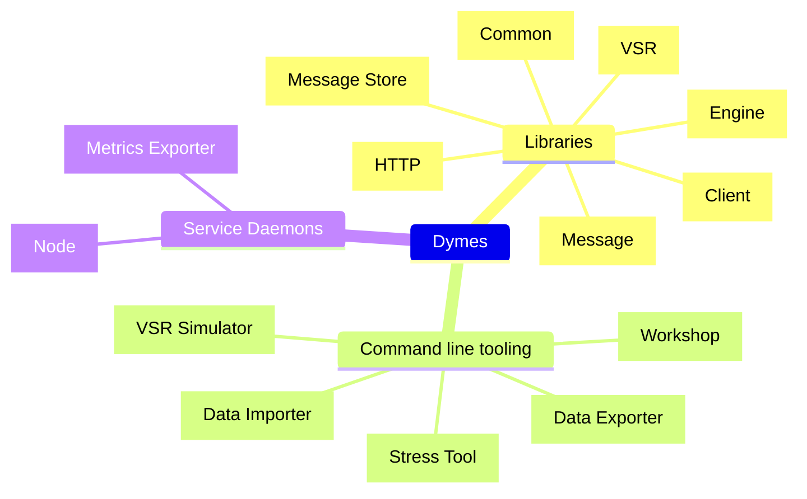
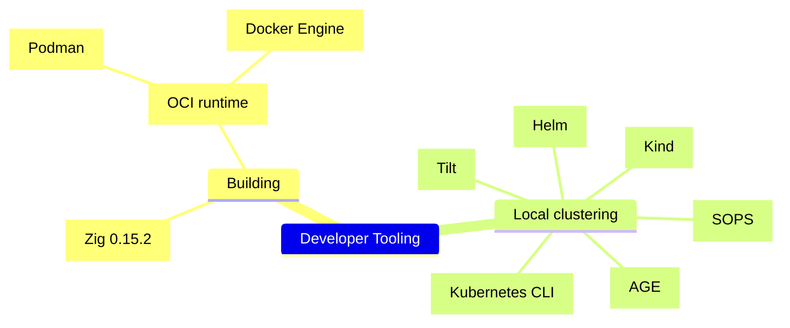

<!--
SPDX-FileCopyrightText: Copyright © 2025 The Dymes project authors

SPDX-License-Identifier: Apache-2.0
-->
# Developing Dymes

## Components



Refer to [Dymes Components](./doc/dymes-components.md) for more detail on the libraries, tools and daemons comprising Dymes.

---
## Development Tooling



Refer to [Development Tooling](./doc/dev-tooling.md) for more detail on the prerequisite libraries, and tools required for Dymes development.

---
## Building and running locally

### Build Dymes and run unit tests

```sh
make
```

or

```sh
zig build test -freference-trace --summary all
```


### Run a local node

```sh
zig build run
```

### Stress the local node

```sh
zig build stress
```

### Build local container image

```sh
make oci
```

or

```sh
scripts/build-oci.sh
```

#### Running interactive using the Docker image

```sh
podman run --rm -p 6510:6510 -it dymes:latest
```

#### Running as daemon using the Docker image

```sh
podman run --name dymes -v ./zig-out/dymes-data:/var/dymes/data -p 6510:6510 -d dymes:latest
```

#### Building release images

```shell
scripts/build-release.sh
```

This builds images for:

| OS     | Processor       | Linkage |
|--------|-----------------|---------|
| linux  | `x86-64/amd64`  | `musl`  |
| linux  | `aarch64/arm64` | `musl`  |


### Dymes HTTP

See [Dymes HTTP](./doc/dymes-http.md) for a description of interactions between a Dymes client and server node.

