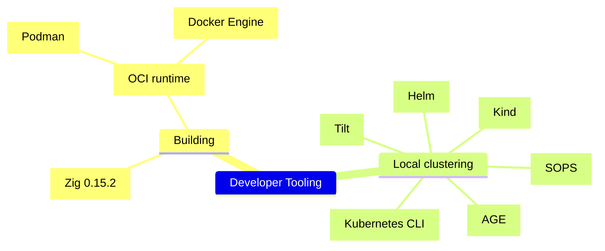

<!--
SPDX-FileCopyrightText: Copyright © 2025 The Dymes project authors

SPDX-License-Identifier: Apache-2.0
-->

# Development Tooling



<!-- TOC -->
* [Development Tooling](#development-tooling)
  * [Zig 0.15.2](#zig-0152)
    * [Installing Zig on macOS](#installing-zig-on-macos)
    * [Installing Zig on Linux](#installing-zig-on-linux)
      * [Alpine Linux](#alpine-linux)
  * [OCI runtime (Podman/Docker)](#oci-runtime-podmandocker)
    * [macOS](#macos)
    * [Linux](#linux)
  * [Helm](#helm)
  * [Kubernetes CLI](#kubernetes-cli)
  * [SOPS](#sops)
  * [AGE](#age)
  * [Kind](#kind)
  * [Tilt](#tilt)
<!-- TOC -->


## [Zig 0.15.2](https://ziglang.org/download/)

See the [Zig Download](https://ziglang.org/download/) page for details.

### Installing Zig on macOS

```sh
brew install zig
brew install zls
```

### Installing Zig on Linux

#### Alpine Linux

```sh
apk add zig
```

## OCI runtime (Podman/Docker)

### macOS

- Podman/Docker Desktop
- Use `containerd`

### Linux

- Podman or Docker Engine with `containerd`

## [Helm](https://helm.sh)

Kubernetes package manager.

```shell
brew install helm
```

## [Kubernetes CLI](https://kubernetes.io/docs/reference/kubectl/)

Command line tool for communicating with a Kubernetes cluster's control plane, using the Kubernetes API.

```shell
brew install kubectl
```

## [SOPS](https://github.com/mozilla/sops)

(Secrets OPerationS): manage secrets.

```shell
brew install gnupg sops
```

## [AGE](https://github.com/FiloSottile/age)

A simple, modern and secure encryption tool (and Go library) with small explicit keys, no config options, and UNIX-style composability.

```shell
brew install age
```

## [Kind](https://kind.sigs.k8s.io)

Kubernetes inside Docker.

```shell
brew install kind
```

## [Tilt](https://tilt.dev)

A toolkit for fixing the pains of microservice development.

```shell
brew install tilt-dev/tap/tilt tilt-dev/tap/ctlptl
```

