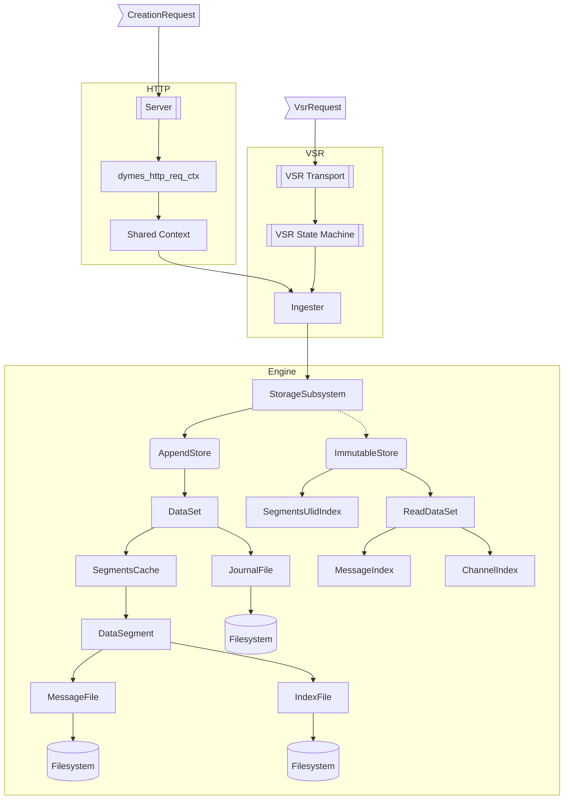
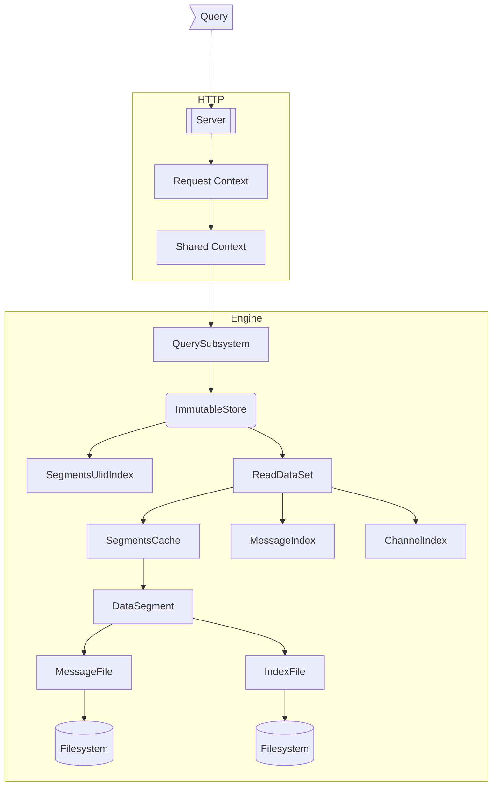

<!--
SPDX-FileCopyrightText: Copyright © 2025 The Dymes project authors

SPDX-License-Identifier: Apache-2.0
-->

# Dymes Component Flow

These diagrams show the [Dymes components](dymes-components.md) involved during high-level operations. 
It may be safely assumed that `dymes_common` and `dymes_msg` would be involved throughout.  

## Appending a message

Components involved when appending a message.

## Querying messages

Components involved when querying messages.

