<!--
SPDX-FileCopyrightText: Copyright © 2025 The Dymes project authors

SPDX-License-Identifier: Apache-2.0
-->

# Dymes Components

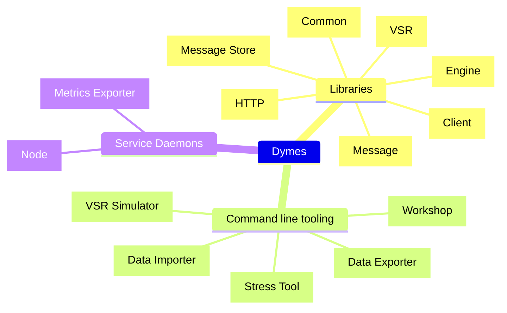

<!-- TOC -->
* [Dymes Components](#dymes-components)
  * [Dymes Libraries](#dymes-libraries)
    * [Common library](#common-library)
    * [Message library](#message-library)
    * [Message store library](#message-store-library)
    * [Engine library](#engine-library)
    * [HTTP library](#http-library)
    * [Client library](#client-library)
    * [VSR library](#vsr-library)
  * [Dymes CLI Tooling](#dymes-cli-tooling)
    * [Data Exporter](#data-exporter)
    * [Data Importer](#data-importer)
    * [VSR Simulator](#vsr-simulator)
    * [Workshop](#workshop)
    * [Stress Tool](#stress-tool)
  * [Dymes Service Daemons](#dymes-service-daemons)
    * [Node](#node)
    * [Metrics Exporter](#metrics-exporter)
<!-- TOC -->

---
## Dymes Libraries

The Dymes libraries are intended to be as self-contained as possible while remaining loosely coupled. This allows library mixing-and-matching as required.
 
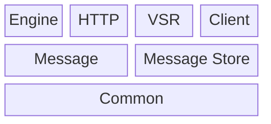

| Library                                 | Description                                                                                           |
|-----------------------------------------|-------------------------------------------------------------------------------------------------------|
| [Common](#common-library)               | Domain-agnostic data structures and utility functions                                                 |
| [Message](#message-library)             | Defines message limits, headers, substructures and builders                                           |
| [Message Store](#message-store-library) | Defines storage limits, data segments, datasets, file formats (data, index and journal)               |
| [Engine](#engine-library)               | Binds the append and immutable stores together, exposing ingress and query functionality              |
| [HTTP](#http-library)                   | An HTTP server with endpoints bound to health, ingress and query support                              |
| [Client](#client-library)               | A minimal HTTP client for testing purposes                                                            |
| [VSR](#vsr-library)                     | A no-frills implementation of [Viewstamped Replication (Revisited)](http://www.pmg.csail.mit.edu/vr/) |

---
### Common library

The common library (`dymes_common`) contains domain-agnostic data structures and utility functions.

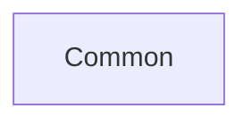

- Common limits, constants, and errors
- Utility functions (checksums, base64, networking, etc.)
- Configuration from yaml, environment, procedural
- Component health check support
- Data structures (In-memory queues, LRU cache, etc.)
- Metrics support

---
### Message library

The message library (`dymes_msg`) defines message limits, headers, substructures and builders.

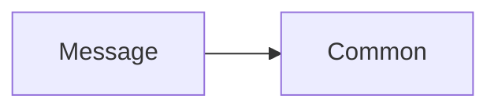

- Message limits, constants and headers
- Message structure with builder
- Creation and import request structures and builders
- Range queries, correlation queries, channel queries

---
### Message store library

The message store library (`dymes_msg_store`) defines storage limits, data segments, datasets, file formats (data, index and journal) and more.

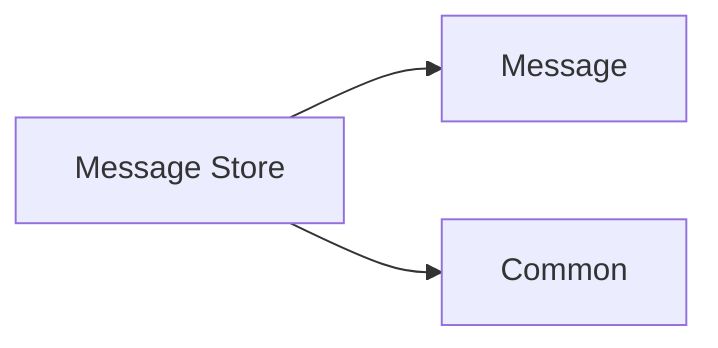

- Storage limits, constants and errors
- Dataset and segment management
- Message, Index and Journal file structures and I/O routines
- Append request structures and builders
- Range, Channel and Correlation query structures and builders
- Append store (Append ops)
- Immutable store (Query ops)

---
### Engine library

The engine library (`dymes_engine`) binds the append and immutable stores together, exposing ingress and query functionality.

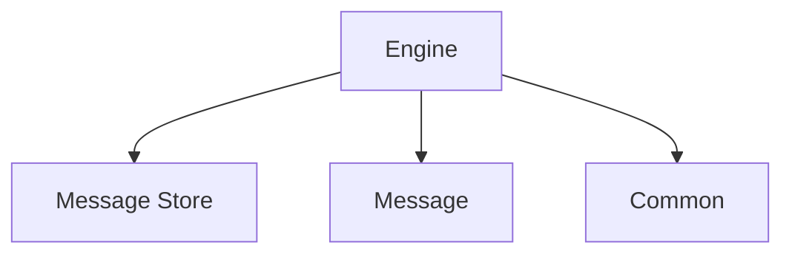

- Message ingestion (append and/or import)
- Queries
  - Range
  - Channel
  - Correlation

---
### HTTP library

The HTTP library (`dymes_http`) provides an HTTP server with endpoints bound to health, ingress and query support.

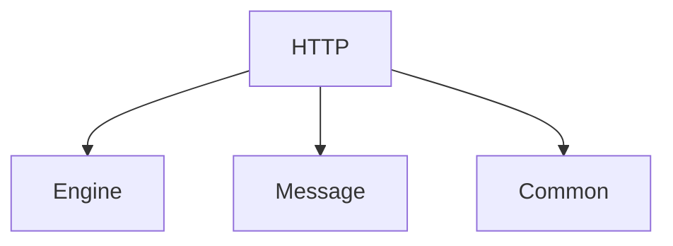

---
### Client library

The client library (`dymes_client`) provides a minimal HTTP client for testing purposes.

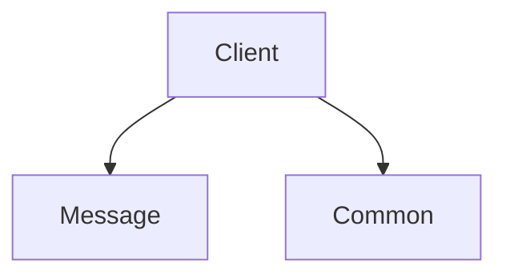

Currently, the client library provides very few guardrails and no retry functionality, since the client will be
replaced entirely once VSR support is complete.

---
### VSR library

The VSR library (`dymes_vsr`) provides a no-frills implementation of [Viewstamped Replication (Revisited)](http://www.pmg.csail.mit.edu/vr/).

- VSR constants and limits
- Structures for VSR operations, message, and state
- Transport for VSR messaging
- Non-blocking state machine
- Minimal VSR client proxy

> This is under active development and not yet complete (missing support for `GetState` and `NewState`)

---
## Dymes CLI Tooling

Command line tooling for operations and development.

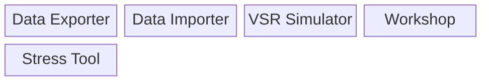

- Data export and import (with a bit of scripting, allows backup/restore)
- Development and testing tools

---
### Data Exporter

Exports query results to a `JSON` file containing import request `DTOs`.

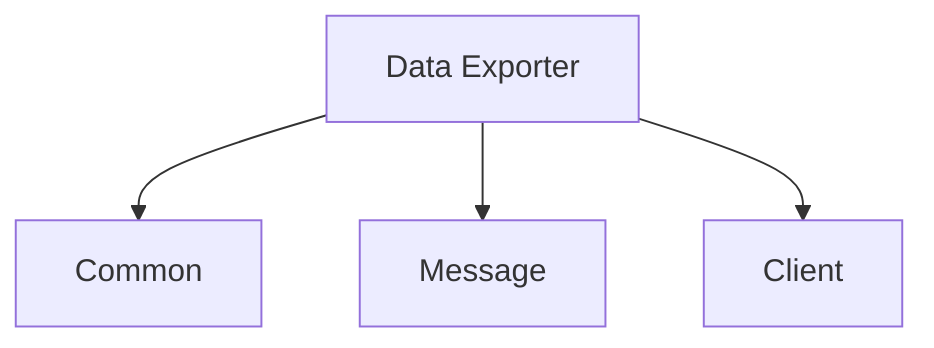

---
### Data Importer

Imports messages from a `JSON` file containing import request `DTOs`.

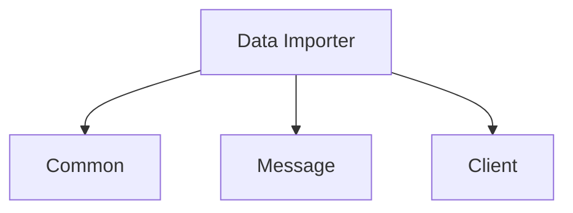

---
### VSR Simulator

Development tool used to set up and test VSR cluster scenarios and manual integration testing.

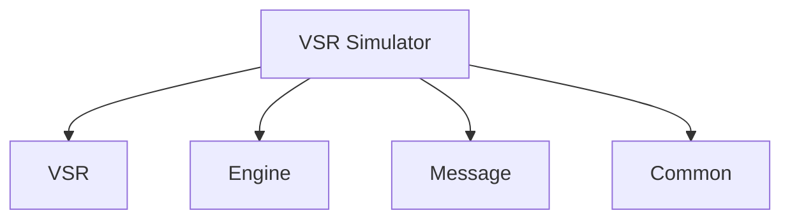

---
### Workshop

Development tool used for experimentation and manual integration testing of non-VSR components.

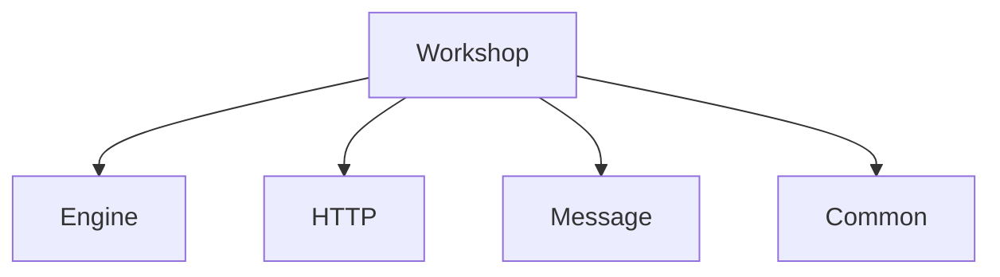

---
### Stress Tool

Testing tool used to generate load for manual testing.

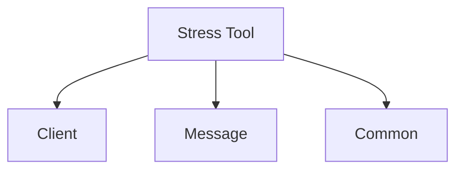

---
## Dymes Service Daemons

These daemons provide the Dymes executable runtime environment.

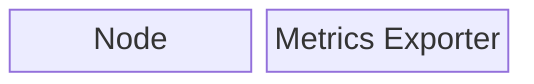

---
### Node

Functions as a node in a Dymes cluster.

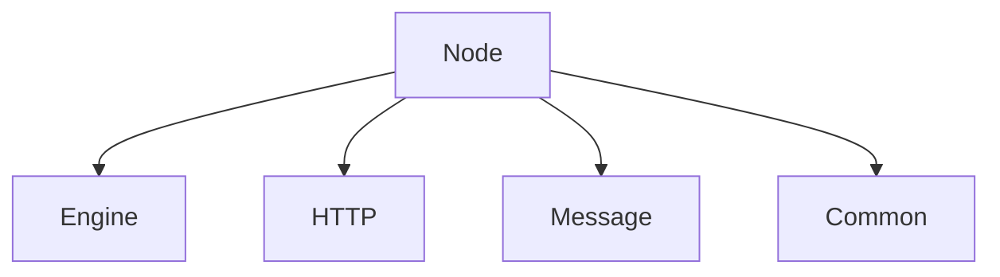

---
### Metrics Exporter

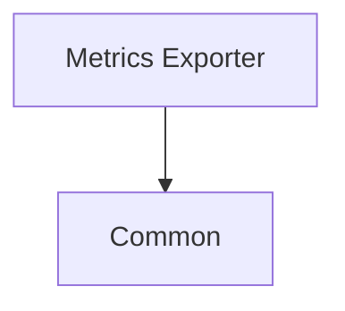

Exports metrics to a [Prometheus](https://prometheus.io) (or [compatible](https://github.com/open-telemetry/opentelemetry-collector-contrib/tree/main/receiver/prometheusreceiver)) collector.

> This daemon is launched as a child of a [Node](#node) process.
> 