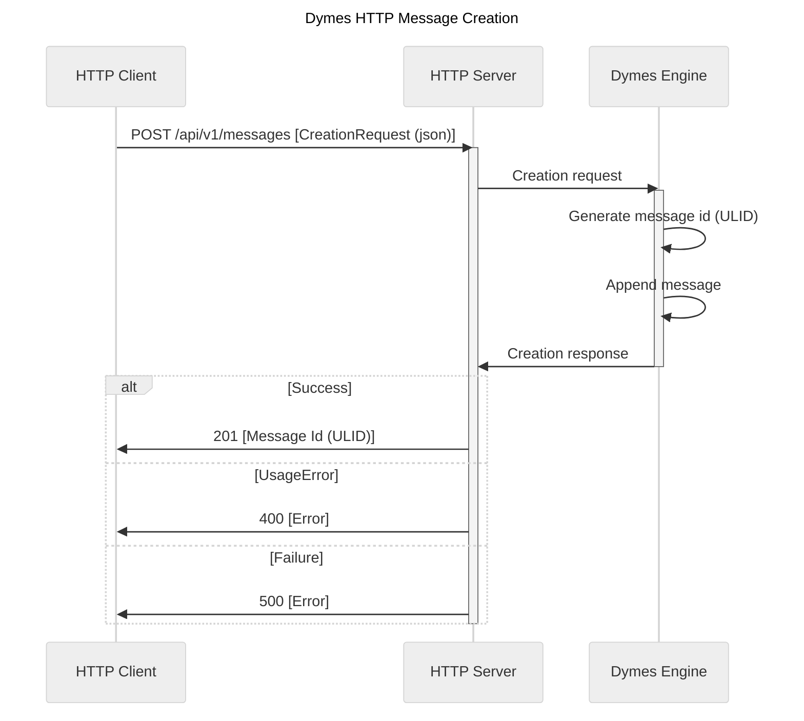
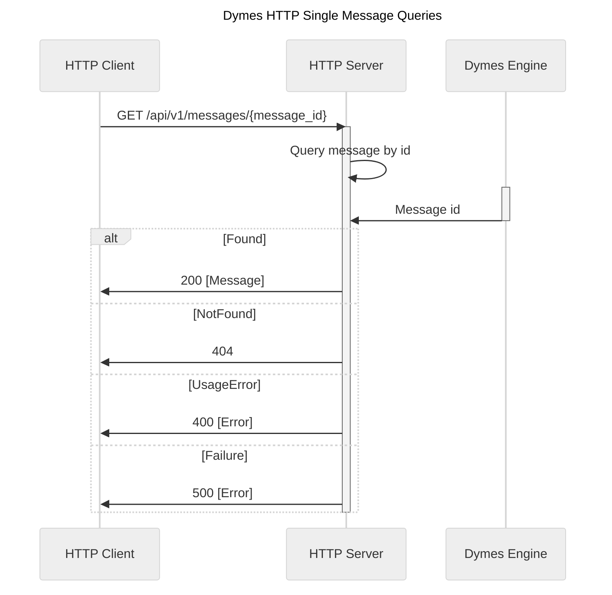
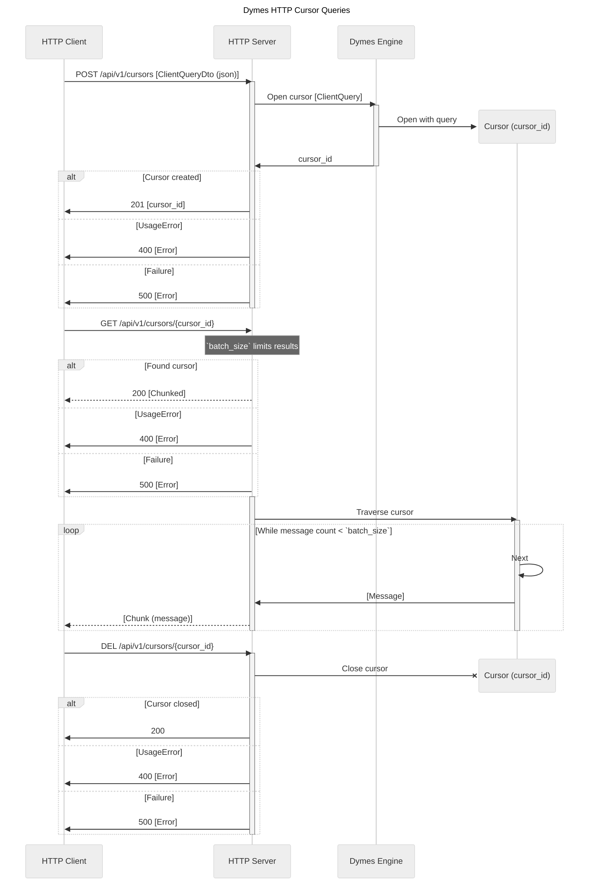

<!--
SPDX-FileCopyrightText: Copyright © 2025 The Dymes project authors

SPDX-License-Identifier: Apache-2.0
-->

# Dymes HTTP Interaction

This document describes the main HTTP interactions between a Dymes client and server node.

<!-- TOC -->
* [Dymes HTTP Interaction](#dymes-http-interaction)
* [Message creation](#message-creation)
  * [Append message](#append-message)
* [Message retrieval](#message-retrieval)
  * [Query message](#query-message)
  * [Cursor queries](#cursor-queries)
<!-- TOC -->

# Message creation

## Append message

Stores a message permanently, while ensuring a global ordering of messages.

# Message retrieval

## Query message

Allows retrieval of a single message from Dymes.

## Cursor queries

Allows retrieveal of a range of messages from Dymes.

